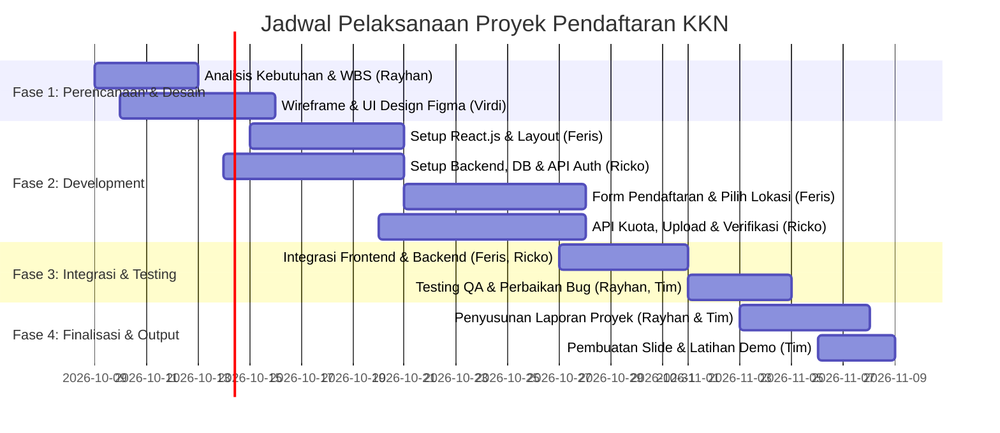

# PROJECT PLAN: APLIKASI PENDAFTARAN KKN
**Mata Kuliah:** Tugas Semester 5  
**Kelompok:** 2  
**Topik:** Sistem Informasi Pendaftaran Kuliah Kerja Nyata (KKN)

---

## 1. Deskripsi & Tujuan Proyek

Aplikasi Pendaftaran KKN dirancang untuk mendigitalisasi dan mempermudah proses pendaftaran KKN bagi mahasiswa, memfasilitasi pemilihan lokasi/desa, unggah berkas persyaratan, serta mempermudah panitia/admin dalam melakukan verifikasi data dan pengumuman penempatan KKN secara transparan dan efisien.

### Output yang Diharapkan:
1. **Aplikasi Web Siap Digunakan:** Frontend interaktif (React.js) terintegrasi dengan REST API backend dan database.
2. **Laporan Proyek:** Dokumentasi lengkap mulai dari analisis kebutuhan, perancangan sistem (UML/ERD), implementasi, hingga pengujian.
3. **Presentasi Hasil:** Slide deck dan demo sistem untuk penilaian akhir.

---

## 2. Struktur Tim & Pembagian Peran

| No | Nama | Peran | Tanggung Jawab Utama |
|---|---|---|---|
| 1 | **Rayhan** | **Project Manager (PM)** | Perencanaan, monitoring timeline, koordinasi tim, QA/pengujian, penyusunan laporan & slide presentasi |
| 2 | **Virdi** | **UI/UX Designer** | Riset alur pengguna, wireframing, perancangan UI/UX (Figma), design system, prototipe interaktif |
| 3 | **Feris** | **Frontend Developer** | Implementasi UI ke React.js, state management, integrasi REST API, validasi form, pengalaman responsif |
| 4 | **Ricko** | **Backend Developer** | Perancangan basis data, pembuatan REST API, autentikasi (JWT), upload berkas/media, business logic kuota KKN |

---

## 3. Rincian Tugas per Anggota (Work Breakdown Structure)

### 1. Rayhan — Project Manager (PM)
* **Manajemen Proyek & Timeline:**
  - Menyusun backlog tugas dan memonitor progress mingguan tim (menggunakan Trello / Notion / GitHub Projects).
  - Mengatur jadwal sinkronisasi berkala (standup meeting) dan penyelesaian kendala (*blocker*).
* **Analisis Kebutuhan & Dokumen SRS:**
  - Menentukan spesifikasi kebutuhan fungsional & non-fungsional sistem.
  - Memastikan seluruh fitur pada poster/brief terpenuhi.
* **Quality Assurance (QA) & UAT:**
  - Melakukan pengujian alur pendaftaran dari sudut pandang mahasiswa dan admin (*black box testing*).
  - Menyusun skenario uji dan mencatat bug untuk diperbaiki Frontend/Backend.
* **Deliverables Akhir:**
  - Mengoordinasikan penulisan **Laporan Proyek** (Bab 1–5).
  - Menyusun materi dan slide **Presentasi Hasil**, serta memimpin jalannya presentasi demo.

---

### 2. Virdi — UI/UX Designer
* **Perancangan Alur & Wireframe:**
  - Membuat *User Flow* pendaftaran mahasiswa dan verifikasi admin.
  - Menyusun *Low-Fidelity (Lo-Fi) Wireframe* untuk seluruh halaman utama.
* **Perancangan High-Fidelity (Hi-Fi) & Design System (Figma):**
  - **Landing Page & Informasi:** Hero section, jadwal KKN, panduan pendaftaran, FAQ.
  - **Autentikasi:** Halaman Login & Registrasi mahasiswa/admin.
  - **Portal Mahasiswa:**
    - Form data diri & akademik (NIM, Jurusan, IPK, Kontak Darurat).
    - Halaman pemilihan lokasi KKN (katalog lokasi, sisa kuota, deskripsi wilayah).
    - Form upload berkas (KRS/KHS, surat izin, surat kesehatan, dll.).
    - Dashboard status pendaftaran & pengumuman hasil penempatan.
  - **Dashboard Admin:**
    - Ringkasan statistik pendaftar & kuota per lokasi.
    - Tabel verifikasi berkas (detail mahasiswa, aksi terima/tolak/revisi).
    - Manajemen data master lokasi KKN (tambah, edit kuota, tutup pendaftaran).
    - Publikasi pengumuman penempatan.
* **Handoff Desain:**
  - Membuat panduan komponen warna, tipografi, ikon, dan aset ekspor untuk **Feris (Frontend)**.

---

### 3. Feris — Frontend Developer (React.js)
* **Setup & Arsitektur Frontend:**
  - Inisialisasi proyek React.js (menggunakan Vite untuk performa cepat dan modern).
  - Konfigurasi router (`react-router-dom`), styling (CSS modern / Tailwind CSS), dan icon pack (Lucide React).
* **Pengembangan Halaman Publik & Mahasiswa:**
  - Slicing desain Landing Page, Informasi Jadwal, dan Panduan.
  - Halaman Registrasi & Login (penyimpanan token, proteksi rute `ProtectedRoute`).
  - Wizard multi-step form pendaftaran (Isi Formulir -> Pilih Lokasi -> Upload Berkas -> Konfirmasi).
  - Halaman Dashboard Mahasiswa & Status Pengumuman Penempatan.
* **Pengembangan Dashboard Admin:**
  - Layout dashboard admin (sidebar, navbar, data tables dengan filter & pencarian).
  - Tampilan preview berkas PDF/gambar yang diupload mahasiswa.
  - Modal/tombol aksi persetujuan verifikasi dan input catatan revisi.
* **Integrasi API & State:**
  - Integrasi API dengan Axios / Fetch ke backend buatan **Ricko**.
  - Penanganan feedback pengguna: toast notification, loading skeleton, error validation.

---

### 4. Ricko — Backend Developer
* **Perancangan Arsitektur Backend & Database:**
  - Menentukan framework backend (contoh: Node.js/Express, NestJS, atau Laravel).
  - Merancang skema database (ERD), relasi tabel, dan migrasi.
* **Autentikasi & Autorisasi:**
  - Sistem Login/Register mahasiswa & admin dengan enkripsi password (Bcrypt).
  - Proteksi endpoint dengan JSON Web Token (JWT) dan middleware *Role-Based Access Control* (Admin vs Mahasiswa).
* **Modul RESTful API:**
  - **API Pendaftaran:** CRUD pendaftaran mahasiswa, validasi syarat semester/SKS.
  - **API Lokasi KKN:** List lokasi, kalkulasi sisa kuota (*atomic update* agar kuota tidak melebihi batas).
  - **API Berkas/Upload:** Endpoint unggah dokumen persyaratan (PDF/JPG/PNG) dengan validasi ukuran & ekstensi file (menggunakan Multer / Cloudinary / Supabase Storage).
  - **API Verifikasi Admin:** Endpoint update status pendaftaran (`Menunggu`, `Diverifikasi`, `Ditolak/Revisi`, `Diterima`).
  - **API Pengumuman:** Endpoint publikasi dan rilis kelompok/lokasi hasil penempatan.
* **Dokumentasi API:**
  - Menyediakan dokumentasi API (Postman Collection / Swagger) agar **Feris** mudah mengintegrasikan frontend.

---

## 4. Rekomendasi Database yang Cocok

Karena frontend menggunakan **React.js**, backend berdiri terpisah melalui REST API. Berikut adalah analisis dan rekomendasi database:

### Rekomendasi Utama: PostgreSQL atau MySQL (Relational Database)
* **Alasan Pemilihan:**
  - **Struktur Data Sangat Terstruktur & Berelasi:** Sistem pendaftaran KKN membutuhkan relasi ketat antara *Mahasiswa* <-> *Formulir Pendaftaran* <-> *Pilihan Lokasi* <-> *Berkas* <-> *Status Verifikasi*.
  - **Integritas Kuota (ACID Transaction):** Pemilihan lokasi KKN memiliki batasan kuota per desa/kelompok. Relational database menjamin kuota tidak bentrok (*race condition*) ketika banyak mahasiswa mendaftar bersamaan.
  - **Standar Akademik & Industri:** PostgreSQL/MySQL adalah standar utama kurikulum semester 5, sangat disukai dosen untuk pengujian relasi foreign key dan normalisasi database.

### Opsi Alternatif Modern: Supabase (PostgreSQL-as-a-Service)
* **Kelebihan:**
  - Otomatis menyediakan database PostgreSQL, Auth bawaan, dan **Storage bucket** untuk upload file/dokumen mahasiswa.
  - Menghemat waktu backend karena upload berkas (KTM, transkrip) langsung terintegrasi dengan URL publik/aman.

### Kesimpulan Rekomendasi:
> Gunakan **PostgreSQL** (atau **MySQL**) jika backend dikembangkan sendiri oleh Ricko menggunakan Node.js/Express (dengan ORM Prisma / Sequelize). Jika ingin fitur upload berkas dan auth instan yang cepat, **Supabase** adalah opsi terbaik.

---

## 5. Rancangan Tabel Basis Data (ERD Ringkas)

1. **`users`**: `id`, `email`, `password_hash`, `role` (`mahasiswa`, `admin`), `created_at`
2. **`mahasiswa_profiles`**: `id`, `user_id`, `nim`, `nama_lengkap`, `program_studi`, `fakultas`, `no_hp`, `jenis_kelamin`, `total_sks`
3. **`locations`**: `id`, `nama_desa_wilayah`, `kecamatan`, `kabupaten`, `kuota_maksimal`, `kuota_terisi`, `periode_kkn`, `status_aktif`
4. **`registrations`**: `id`, `mahasiswa_id`, `location_id`, `status` (`pending`, `verified`, `revision`, `approved`, `rejected`), `catatan_admin`, `tanggal_daftar`
5. **`registration_files`**: `id`, `registration_id`, `jenis_berkas` (KTM, KHS/Transkrip, Surat Sehat), `file_url`, `uploaded_at`
6. **`announcements`**: `id`, `judul`, `konten`, `tanggal_rilis`, `lampiran_pdf_url`

---

## 6. Timeline & Fase Pengerjaan (4 Minggu)

| Minggu | Fokus Kegiatan | Output Utama | PIC Utama |
|---|---|---|---|
| **Minggu 1** | Analisis kebutuhan, perancangan User Flow, Mockup Figma, dan Desain Database (ERD) | Dokumen Kebutuhan, Desain Figma (Hi-Fi), Skema DB | Virdi, Rayhan, Ricko |
| **Minggu 2** | Setup arsitektur React.js, pembuatan layout, slicing landing page & API Auth/CRUD dasar | Skeletons UI React, API Auth & Master Lokasi | Feris, Ricko |
| **Minggu 3** | Form pendaftaran multi-step, upload berkas, dashboard admin verifikasi data | Fitur pendaftaran & verifikasi berfungsi di dev | Feris, Ricko |
| **Minggu 4** | Integrasi end-to-end, testing (QA), penyusunan Laporan Proyek dan Slide Presentasi | Web pendaftaran KKN live/ready, Laporan, Slide | Rayhan (All Team) |

---

## 7. Definisi Selesai (Definition of Done)
- [ ] Mahasiswa dapat mendaftar, memilih lokasi KKN (kuota terpotong otomatis), dan mengunggah berkas persyaratan.
- [ ] Admin dapat login, melihat daftar pendaftar, memverifikasi/menolak berkas dengan catatan, dan mengumumkan hasil.
- [ ] Antarmuka responsif dan nyaman digunakan di desktop maupun smartphone.
- [ ] Laporan proyek selesai lengkap dengan diagram alur dan dokumentasi pengujian.
- [ ] Slide presentasi siap dan demo aplikasi berjalan lancar tanpa error saat presentasi.
